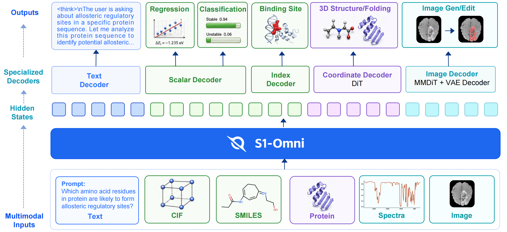
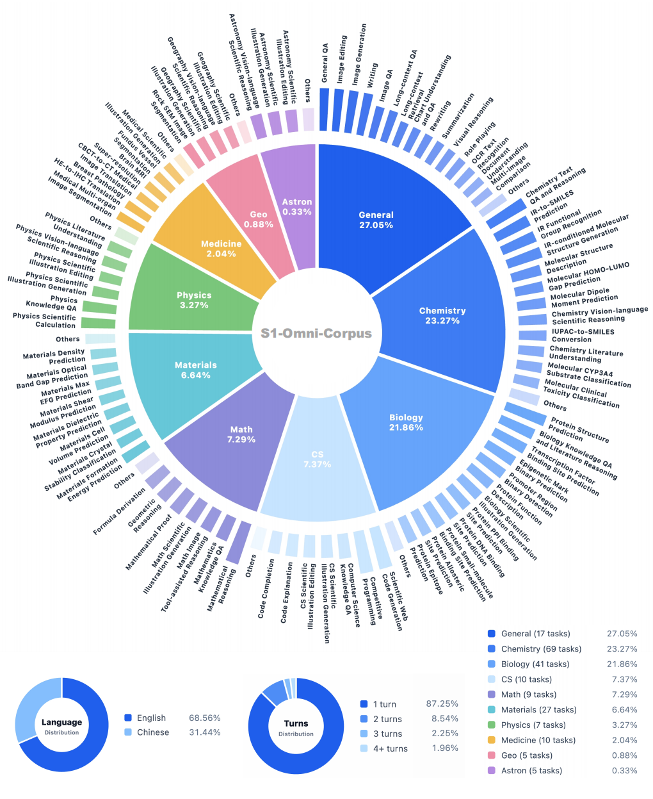

<div align="center">

# S1-Omni

**A Unified Scientific Multimodal Reasoning Model**

[](https://scienceone-ai.github.io/S1-Omni)
[](https://github.com/ScienceOne-AI/S1-Omni)
[](https://huggingface.co/ScienceOne-AI/S1-Omni)
[](https://modelscope.cn/models/ScienceOne-AI/S1-Omni)
[](代码仓库/S1-Omni-pro/LICENSE)

</div>

## 🧬 Model Introduction

We present S1-Omni, a unified scientific multimodal reasoning model for scientific understanding, prediction, and generation. It is developed by the ScienceOne AI team of the Chinese Academy of Sciences. 

S1-Omni addresses fragmented scientific AI capabilities with a shared backbone for cross-disciplinary, cross-modal, and cross-task understanding and reasoning, plus science-specific decoders for verifiable outputs. Unified encoding maps natural-language instructions and typed scientific objects, including material CIFs, chemical SMILES, protein sequences, spectra, and scientific images, into shared task representations. Knowledge alignment integrates scientific laws, experimental facts, and expert knowledge into data construction, validation, and training, grounding judgments in evidence. Task-oriented decoding converts the representations into verifiable outputs through specialized decoders for property prediction, spectrum-to-structure reconstruction, protein site and structure prediction, and scientific image generation and editing.

S1-Omni is built around three core capabilities:

- **Unified Representation of Scientific Data**: The model jointly organizes natural-language instructions and diverse scientific objects into a unified task representation, covering scientific modalities including text, material CIFs, chemical SMILES, protein sequences, spectra, and scientific images. At the same time, it preserves the type boundaries, representational structures, and necessary encoding pathways of different objects.
- **Natural-World Knowledge Alignment**: Model training relies not only on statistical associations between inputs and outputs, but also incorporates scientific laws, experimental facts, and expert knowledge into data construction, sample validation, and the training process. This enables the model to form intermediate judgments from the scientific evidence available in the current task, strengthening scientific reasoning and interpretability.
- **Decoding for Domain-Specific Tasks**: Building on shared task understanding and scientific reasoning, the model connects to the appropriate result representation and generation modules according to the specific task objective, allowing a unified model to produce verifiable outputs in each domain's native result space.

<div align="center">
  
  <br>
</div>

## 🤗 Model Release

Model weights are available from the following platforms:

| Platform | URL |
| --- | --- |
| Hugging Face | `https://huggingface.co/ScienceOne-AI/S1-Omni` |
| ModelScope | `https://modelscope.cn/models/ScienceOne-AI/S1-Omni` |

The model-weight directory mainly contains:

| Type | Files / Directories |
| --- | --- |
| Model weights | `model-00001-of-00021.safetensors` to `model-00021-of-00021.safetensors` |
| Weight index | `model.safetensors.index.json` |
| Model configuration | `config.json`, `configuration.json`, `generation_config.json` |
| Tokenizer | `tokenizer.json`, `tokenizer_config.json`, `vocab.json`, `added_tokens.json`, `special_tokens_map.json`, `chat_template.jinja` |
| Input preprocessing configuration | `processor_config.json`, `preprocessor_config.json`, `video_preprocessor_config.json` |
| Image decoder configuration | `s1_omni_image_config.json` |
| Protein-task configuration | `esm2/`, `s1_protein_config.json`, `simplefold_config.json`, `simplefold.safetensors.index.json` |

## 📚 Data Release

**S1-Omni-Corpus** is a large-scale training corpus for unified scientific multimodal reasoning. It is organized around heterogeneous scientific data unification, expert-experience-aligned reasoning, and domain-native supervision. The corpus covers mathematics, physics, chemistry, biology, materials science, medicine, geography, astronomy, and computer science, and includes scientific question answering, literature reasoning, molecular and materials property prediction, protein function and binding-site prediction, protein-structure-related tasks, spectrum-to-molecular-structure prediction, and scientific image generation and editing.

<div align="center">
  
  <br>
</div>

The full S1-Omni-Corpus covers over 200 scientific tasks with million-scale reasoning samples. We also release the representative subset **S1-Omni-Corpus-10K**, which is curated from the S1-Omni training corpus and contains **10,468** complete training samples for data-pipeline analysis, task-protocol research, and community reproduction.

The open-source data are available from:

| Platform | URL |
| --- | --- |
| Hugging Face | `https://huggingface.co/datasets/ScienceOne-AI/S1-Omni-Corpus-10K` |
| ModelScope | `https://modelscope.cn/datasets/ScienceOne-AI/S1-Omni-Corpus-10K` |

Each JSONL record contains `data_id`, `messages`, `images`, and `meta`:

```json
{
  "data_id": "XXXXXX",
  "messages": [
    {
      "role": "user",
      "content": "User question and scientific-object context"
    },
    {
      "role": "assistant",
      "content": "<think>...reasoning process...</think>\n\nModel response and task-specific token"
    }
  ],
  "images": [],
  "meta": {
    "subject": "...",
    "task_type": "...",
    "language": "en",
    "turns": 1,
    "label": null
  }
}
```

Field descriptions:

- `data_id`: Unique data ID.
- `messages`: Data content. `role` contains `user` and `assistant`. `content` contains the user prompt and scientific objects.
- `images`: Relative paths of user-input images. Missing values are represented as `[]`. Image and spectra subsets use `assets/...` paths, while text-only records use `[]`.
- `meta`: Metadata object containing only `subject`, `task_type`, `language`, `turns`, and `label`.

`meta` field descriptions:

| Field | Type / Values | Description |
| --- | --- | --- |
| `subject` | Discipline | `Chemistry`, `Biology`, `Medicine`, `Materials`, `CS`, `Physics`, `Geography`, `Math`, `Astronomy` |
| `task_type` | Task type | Examples include `IR spectrum to SMILES prediction`, `Protein PPI binding site prediction`, `Image editing`, etc. |
| `language` | Sample language | `en` / `zh` |
| `turns` | int | Number of user turns. `1` means single-turn. |
| `label` | object / null | Annotation information. When non-null, it contains `type` and `value`; `value` is the decoder output object for the current scientific task. |

Task-specific tokens:

- `<image_edit>` / `<image_gen>`: Image editing and image generation tasks
- `<prot_st>` / `<prot_cla>`: Protein structure and protein classification tasks
- `<linear_pre>` / `<linear_cla>`: Linear prediction and classification tasks
- `<spectra_st>`: Spectrum-to-molecular-structure prediction task

## 🚀 Quick Start

### 1. Set Up the Inference Environment

Enter the inference-code directory:

```bash
cd S1-Omni/code
```

Download the reference files required for structure prediction:

```bash
# Follow the txt file in this directory and download the pt files here.
cd simplefold_inference_pt
```

Install the inference environment (Python 3.10 is recommended):

```bash
cd S1-Omni/code
bash install.sh
```

### 2. Download Weights

Download the model weights from Hugging Face or ModelScope and place them in a local checkpoint directory:

```bash
mkdir -p checkpoints/S1-Omni
```

Refer to the "Model Release" section and download the complete model weights. The model service loads from the merged-weight directory by default. If the weights are stored elsewhere, specify the path with `--checkpoint_dir` when starting the service. You can also modify the default model path in `s1_omni_infer/infer_s1_omni_checkpoint.py`.

### 3. Start the Model Service

Starting S1-Omni requires approximately `2 * 80G` GPU memory. We recommend starting the OpenAI-compatible service from the project directory:

```bash
python s1_omni_infer/serve_s1_omni_openai.py \
  --checkpoint_dir checkpoints/S1-Omni \
  --host 0.0.0.0 \
  --port 8009 \
  --model_name s1-omni
```

The default service URL is `http://<host>:8009`. Check service status with:

```bash
curl http://<host>:8009/health
```

Main endpoints:

| Endpoint | Description |
| --- | --- |
| `POST /v1/chat/completions` | OpenAI-compatible chat endpoint. The test script uses this endpoint by default. |
| `GET /health` | Service health check |

### 4. Request and Response Format

The request format is basically compatible with OpenAI Chat Completions:

```json
{
  "model": "s1-omni",
  "messages": [
    {
      "role": "user",
      "content": [
        {
          "type": "text",
          "text": "User question"
        }
      ]
    }
  ],
  "max_new_tokens": 8192,
  "temperature": 0.2
}
```

Response format:

```jsonc
{
  "id": "chatcmpl-...",
  "object": "chat.completion",
  "created": 1760000000,
  "model": "s1-omni",
  "choices": [
    {
      "index": 0,
      "message": {
        "role": "assistant",
        "content": "Final text returned to the user or generated file path"
      },
      "finish_reason": "stop"
    }
  ],
  "final_text": "Final text returned to the user or generated file path",
  "result": {
    "question": "...",
    "generation_question": "...",
    "llm_output": "...<route_token>",
    "final_special_token": "<route_token>",
    "selected_by": "classification | regression | protein | simplefold | image_gen | image_edit | spectra | unknown",
    "prediction": {
      "...": "..."
    },
    "final_text": "Final text returned to the user or generated scientific-object file path"
  }
}
```

For application integration, read the `final_text` field first. `result` keeps the route, raw LLM output, and structured results from task decoders.

### 5. Use the Test Script

List built-in task examples:

```bash
python s1_omni_infer/test_s1_omni_openai_client.py \
  --url http://<host>:8009/v1/chat/completions \
  --list
```

Run a specified task:

```bash
python s1_omni_infer/test_s1_omni_openai_client.py \
  --url http://<host>:8009/v1/chat/completions \
  --task protein_site
```

Start the Gradio visual interface:

```bash
python s1_omni_infer/s1_omni_openai_gradio.py
```

### 6. Task Invocation Examples

#### 6.1 Protein Binding-Site Prediction: `protein_site`

Request:

```jsonc
{
  "model": "s1-omni",
  "messages": [
    {
      "role": "user",
      "content": [
        {
          "type": "text",
          "text": "Given protein sequence <PROT>KETAAAKFERQHMDSSTSAASSSNYCNQMMKSRNLTKDRCKPVNTFVHESLADVQAVCSQKNVACKNGQTNCYQSYSTMSITDCRETGSSKYPNCAYKTTQANKHIIVACEGNPYVPVHFDASV</PROT>, predict the residues that form protein-protein interaction (PPI) binding sites."
        }
      ]
    }
  ],
  "max_new_tokens": 8192,
  "temperature": 0.2
}
```

#### 6.2 Protein Structure Prediction: `protein_fold`

Request:

```jsonc
{
  "model": "s1-omni",
  "messages": [
    {
      "role": "user",
      "content": [
        {
          "type": "text",
          "text": "You are an assistant for protein modeling. After the user provides a sequence, explain how functional and domain cues affect structure prediction.\n\n<PROT>MLNGISNAASTLGRQLVGIASRVSSAGGTGFSVAPQAVRLTPVRVHSPFSPGSSNVNARTIFNVSSQVTSFTPSRPAPPPPTSGQASGASRPLPPIAQALKDHLAAYELSKASETVNFKPTRPAPPPPTSGQASGASRPLPPIAQALKDHLAAYELSKASETVSFKPTRQAPPPPTSGQASGPGGLPPLAQALKDHLAAYEQSKKG</PROT>"
        }
      ]
    }
  ],
  "max_new_tokens": 8192
}
```

#### 6.3 Small-Molecule Property Classification: `property_classification`

Request:

```jsonc
{
  "model": "s1-omni",
  "messages": [
    {
      "role": "user",
      "content": [
        {
          "type": "text",
          "text": "Can <SMILES>CCOP(=O)(OCC)C12CC(C)C=CC1COC2=O</SMILES> be considered active against HIV replication?"
        }
      ]
    }
  ],
  "max_new_tokens": 8192
}
```

#### 6.4 Small-Molecule / Materials Property Regression: `property_regression`

Request:

```jsonc
{
  "model": "s1-omni",
  "messages": [
    {
      "role": "user",
      "content": [
        {
          "type": "text",
          "text": "Evaluate the water solubility of <SMILES>C1=CC2=CC=C3C=CC4=CC=C5C=CC6=CC=C1C1=C2C3=C4C5=C61</SMILES> and report the ESOL log S value."
        }
      ]
    }
  ],
  "max_new_tokens": 8192
}
```

#### 6.5 Text-to-Image Generation: `image_generation`

Request:

```jsonc
{
  "model": "s1-omni",
  "messages": [
    {
      "role": "user",
      "content": [
        {
          "type": "text",
          "text": "Generate a cross-sectional illustration of the inside of a human cell, with mitochondria, DNA double helix, and ribosomes floating inside, a moist translucent cell membrane, soft cyan, mint green, and light pink colors, flowing liquid cytoplasm, soft glow, a pure white minimalist laboratory background, clean and transparent, biomedical popular-science illustration, flat fine texture, high definition, English text, HD."
        }
      ]
    }
  ],
  "max_new_tokens": 8192
}
```

#### 6.6 Image Editing: `image_edit`

Request:

```jsonc
{
  "model": "s1-omni",
  "messages": [
    {
      "role": "user",
      "content": [
        {
          "type": "image_url",
          "image_url": "/path/to/your_image.png"
        },
        {
          "type": "text",
          "text": "Change the image background color to light brown."
        }
      ]
    }
  ],
  "max_new_tokens": 8192
}
```

#### 6.7 Spectrum-to-Molecule Generation: `spectra`

Request:

```jsonc
{
  "model": "s1-omni",
  "messages": [
    {
      "role": "user",
      "content": [
        {
          "type": "jdx_files",
          "jdx_files": [
            "/path/to/000010_ir.jdx",
            "/path/to/000010_raman.jdx",
            "/path/to/000010_uv.jdx"
          ]
        },
        {
          "type": "text",
          "text": "Predict the possible molecular structure based on the provided infrared, Raman, and UV spectra."
        }
      ]
    }
  ],
  "max_new_tokens": 8192,
  "force_spectra": true
}
```

## 📄 License

The code, model weights, and dataset of this project are released under the Apache License 2.0.

S1-Omni is released for scientific research scenarios. Scientific tasks may involve experimental conditions, measurement errors, task-protocol differences, and domain-knowledge boundaries. Model outputs should not be used as the sole basis for experimental decisions, clinical judgments, materials screening, or engineering deployment. Critical scientific conclusions should be reviewed together with professional tools, experimental validation, and domain experts.

## 📖 Citation

If S1-Omni is useful for your research, please cite our technical report. The formal citation format will be updated after the paper or technical report is released.

```bibtex
@misc{s1omni2026,
  title  = {S1-Omni: A Unified Multimodal Reasoning Model for Scientific Understanding, Prediction, and Generation},
  author = {ScienceOne AI and Wenge AI},
  year   = {2026}
}
```
